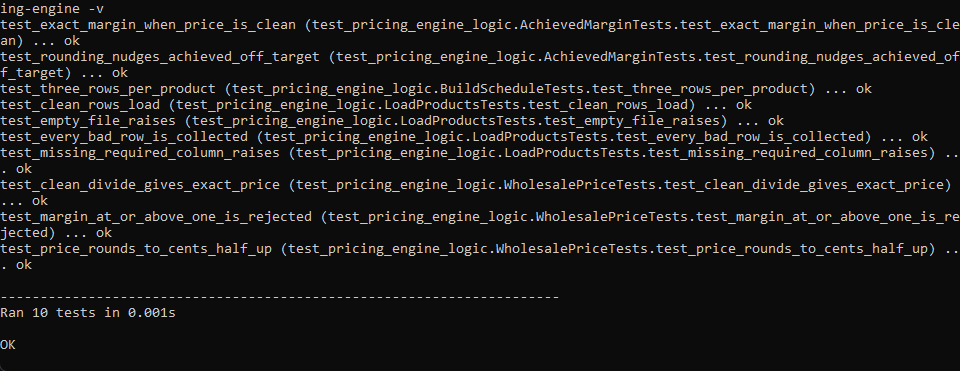
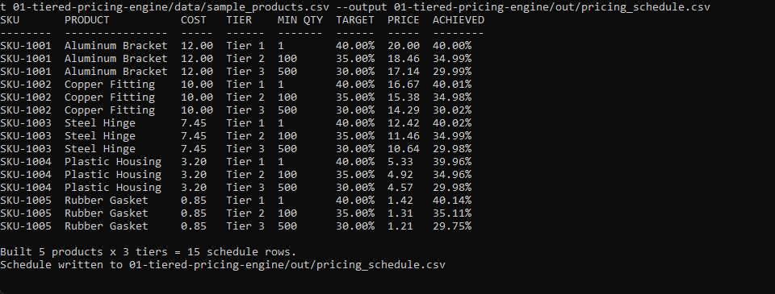
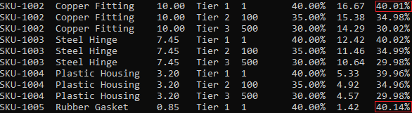
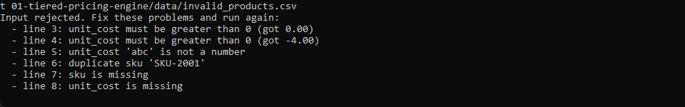

# Tiered Pricing Engine

A command-line utility that turns a product cost master into a tiered wholesale
pricing schedule. For each product it sets a price at every volume tier so the
sale earns that tier's target gross margin, then reports the margin actually
achieved after rounding to the cent.

This is the first of three tools in the pricing and profitability toolkit. It
runs first because the other two tools read the pricing schedule it produces.

## What it does

- Reads a CSV of products with their unit costs.
- Validates the file and rejects bad data with line-referenced messages.
- Builds a price for three volume tiers (40%, 35%, 30% target margins).
- Prints a readable table and writes the schedule to CSV.

Full details are in [spec.md](spec.md).

## Requirements

Python 3, standard library only. No installs.

## Files

- `pricing_engine_logic.py` is the pure logic: the price and margin math plus the
  validation rules. It does no printing and no file reading, so it is easy to test.
- `cli.py` is the thin wrapper that reads the CSV, calls the logic, prints the
  table, and writes the output.
- `test_pricing_engine_logic.py` checks the logic against hand-worked numbers.
- `data/sample_products.csv` is a clean product master.
- `data/invalid_products.csv` is a deliberately broken file for testing rejection.
- `data/pricing_schedule.csv` is a committed copy of one clean run, used as the
  approved pricing reference by tools 2 and 3.

## How to run

Run these from inside this folder.

Run the test suite:

```
python -m unittest -v
```

Build the schedule from the clean sample:

```
python cli.py
```

Point it at a different input or output:

```
python cli.py --input data/sample_products.csv --output out/pricing_schedule.csv
```

See the validation reject bad data:

```
python cli.py --input data/invalid_products.csv
```

## In action

The test suite passing. Each calculation is checked against numbers worked out by hand.



The full pricing schedule built from the clean sample: five products across three volume tiers. The first row, SKU-1001 at Tier 1, prices to exactly 20.00 and earns exactly 40.00%.



The rounding deviation made visible. SKU-1002 earns 40.01% and SKU-1005 earns 40.14% after the price is rounded to the cent, so the tool reports the real margin rather than the target it was aiming for.



Bad data rejected. A file with a zero cost, a negative cost, a non-numeric cost, a duplicate sku, a missing sku, and a missing cost is refused with one message per problem instead of producing a wrong schedule.



## Money and margin handling

All cost, price, and margin math uses `decimal.Decimal` with `ROUND_HALF_UP`.
Prices round to the cent, margins keep four places, and every figure prints in
fixed-point form, never scientific notation.
