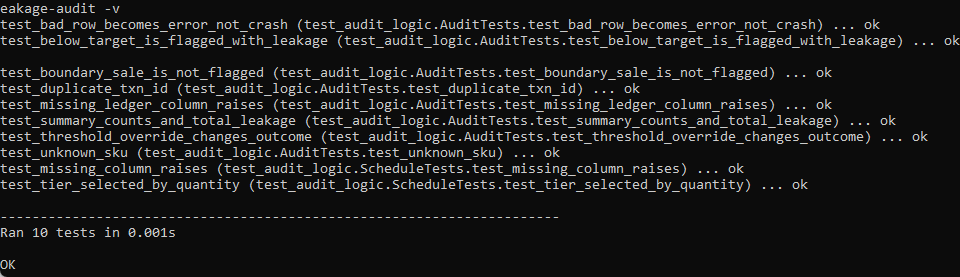
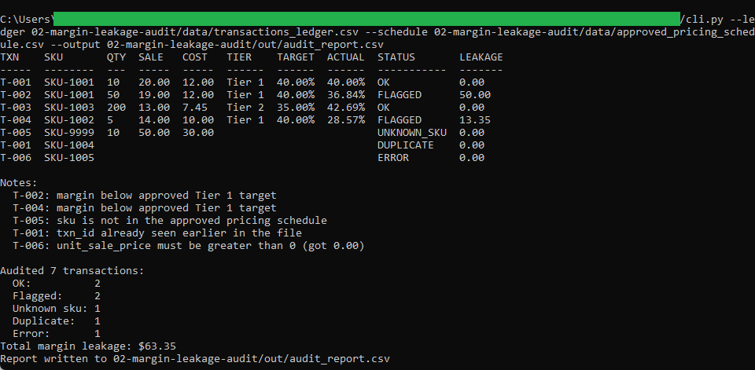
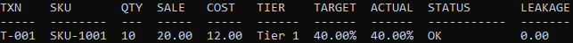
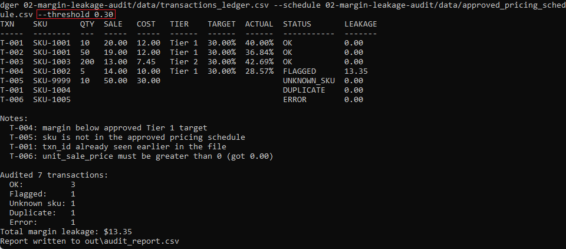
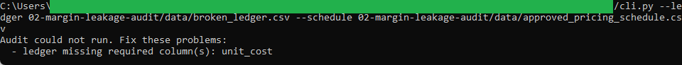

# Margin Leakage Audit

A command-line utility that audits a transaction ledger against an approved
pricing schedule and flags any sale whose gross margin fell below the approved
target for its volume tier. Those flagged sales are where margin leaked.

This is the second of three tools in the pricing and profitability toolkit. It
reads the pricing schedule produced by tool 1, so build tool 1 first. A copy of
that schedule ships in this folder, so the audit also runs on its own.

## What it does

- Reads a transaction ledger and the approved pricing schedule.
- Picks the right volume tier for each sale by its order quantity.
- Compares the actual margin against the approved target for that tier.
- Marks each sale OK, FLAGGED, UNKNOWN_SKU, DUPLICATE, or ERROR.
- Reports per-transaction results, total margin leakage, and writes a CSV.

Full details are in [spec.md](spec.md).

## Requirements

Python 3, standard library only. No installs.

## Files

- `audit_logic.py` is the pure logic: tier selection, margin math, and the
  status rules. It does no printing and no file reading.
- `cli.py` is the thin wrapper that reads the CSVs, calls the logic, prints the
  report, and writes the output.
- `test_audit_logic.py` checks the logic against hand-worked numbers, including
  the boundary case that proves agreement with tool 1.
- `data/transactions_ledger.csv` is a sample ledger that exercises every status.
- `data/broken_ledger.csv` is missing a column, for testing file-level rejection.
- `data/approved_pricing_schedule.csv` is the committed copy of tool 1's output.

## How to run

Run these from inside this folder.

Run the test suite:

```
python -m unittest -v
```

Audit the sample ledger:

```
python cli.py
```

Apply one company-wide margin bar instead of the per-tier targets:

```
python cli.py --threshold 0.35
```

See the audit reject a malformed file:

```
python cli.py --ledger data/broken_ledger.csv
```

## How this agrees with tool 1

Tool 1 prices `SKU-1001` at Tier 1 to `20.00`, targeting a 40% margin. The first
row of the sample ledger sells `SKU-1001` at exactly `20.00`. This audit reads
that sale back as `40.00%` and leaves it unflagged, since it meets the target.
The same number, `20.00` and `40.00%`, is documented in both tools' specs.

## In action

The test suite passing. Tier selection, margin math, and the status rules are each checked against numbers worked out by hand.



The headline audit of the sample ledger. One run surfaces every status: two clean sales, two flagged sales with their leakage, an unknown SKU, a duplicate transaction id, and a row error, with total leakage of 63.35.



The cross-tool agreement, isolated. Tool 1 priced SKU-1001 at Tier 1 to 20.00 against a 40 percent target. Here the same sale at 20.00 reads back as exactly 40.00 percent and stays unflagged, because it meets the target. Tool 1 set the number and this tool independently measured the same number.



The same ledger judged against one company-wide 30 percent bar instead of the per-tier targets. Compare this against the report two images above: with the bar lowered, T-002 now passes, only T-004 stays flagged, and total leakage drops from 63.35 to 13.35. Same data, different policy, different verdict.



Bad data rejected at the file level. A ledger missing the unit_cost column is refused before any row is audited, which is different from the single-row ERROR seen in the headline run.



## Money and margin handling

All cost, price, and margin math uses `decimal.Decimal` with `ROUND_HALF_UP`.
Money prints to the cent, margins print as fixed-point percent, and no value
appears in scientific notation.
