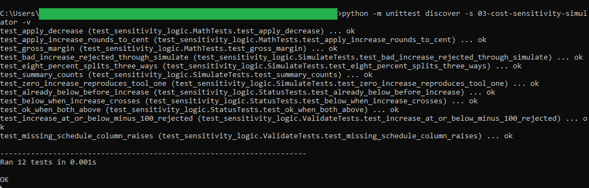
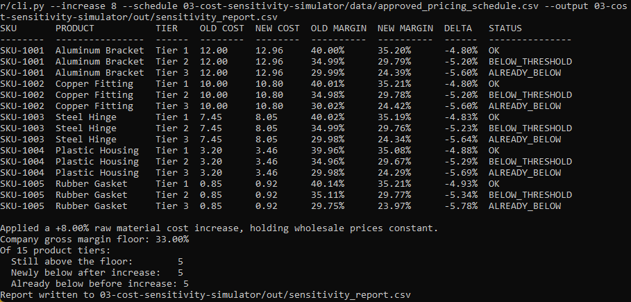
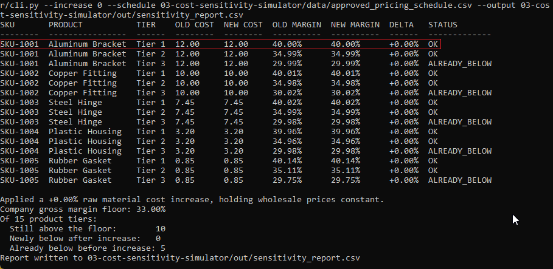
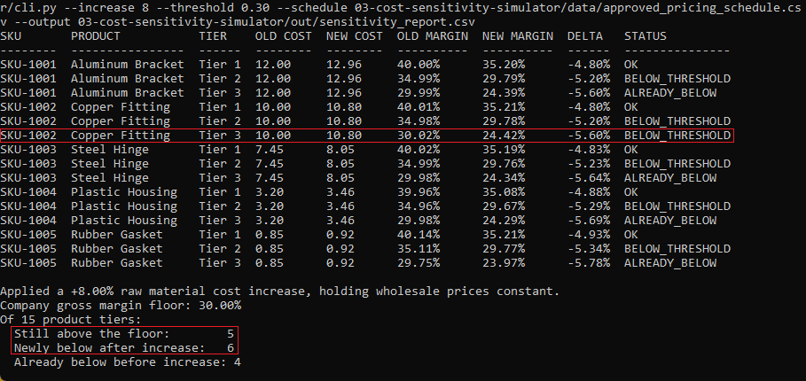
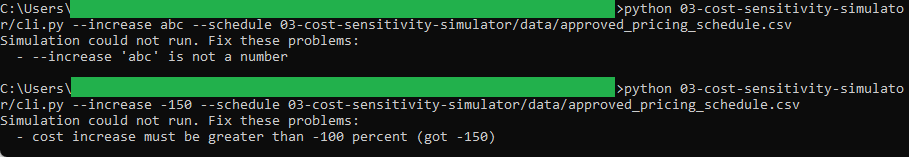

# Product Cost Sensitivity Simulator

A command-line utility that shows how a raw material cost increase compresses
gross margins. Enter a percentage increase and the tool applies it across the
approved pricing schedule, holds each wholesale price constant, and reports the
margin before and after, flagging any product that falls under the company floor.

This is the third of three tools in the pricing and profitability toolkit. It
reads the pricing schedule produced by tool 1, so build tool 1 first. A copy of
that schedule ships in this folder, so the simulator also runs on its own.

## What it does

- Reads the approved pricing schedule.
- Raises every product's cost by the percentage you give.
- Recomputes each gross margin with the wholesale price held constant.
- Marks each row OK, BELOW_THRESHOLD, or ALREADY_BELOW against the floor.
- Reports the before and after margins, the change, and a summary, then writes a CSV.

Full details are in [spec.md](spec.md).

## Requirements

Python 3, standard library only. No installs.

## Files

- `sensitivity_logic.py` is the pure logic: the cost and margin math and the
  status rules. It does no printing and no file reading.
- `cli.py` is the thin wrapper that reads the schedule, calls the logic, prints
  the table, and writes the output.
- `test_sensitivity_logic.py` checks the logic against hand-worked numbers,
  including the zero-increase case that reproduces tool 1's margins.
- `data/approved_pricing_schedule.csv` is the committed copy of tool 1's output.

## How to run

Run these from inside this folder.

Run the test suite:

```
python -m unittest -v
```

Apply an 8 percent raw material cost increase:

```
python cli.py --increase 8
```

Use a different company margin floor:

```
python cli.py --increase 8 --threshold 0.30
```

Run the zero-change sanity check:

```
python cli.py --increase 0
```

See it reject bad input:

```
python cli.py --increase abc
```

## How this connects to tool 1

The simulator reads the same approved schedule tool 1 produced. With `--increase
0` it reproduces tool 1's achieved margins exactly, so `SKU-1001` Tier 1 reads
`40.00%`, matching the price of `20.00` tool 1 set for it. From that shared
baseline, each cost increase shows how far the fixed price book is from the
company margin floor.

## In action

The test suite passing. The cost and margin math and the status rules are each checked against numbers worked out by hand.



An 8 percent raw material cost increase against the default 33 percent floor. One run splits cleanly three ways: every Tier 1 row holds above the floor, every Tier 2 row crosses below it, and every Tier 3 row was already below before the increase.



The zero-change baseline. With no increase applied, every new margin equals the original, and the top row reads 40.00 percent, the same margin tool 1 set when it priced SKU-1001 to 20.00. Running the simulator at zero increase reproduces tool 1's schedule exactly.



The same 8 percent increase judged against a lower 30 percent floor. The boxed SKU-1002 Tier 3 row tells the story: its starting margin of 30.02 percent sits above a 30 percent floor but below a 33 percent floor, so the row that read ALREADY_BELOW in the previous image now reads BELOW_THRESHOLD here. That one flip moves the summary counts, boxed below. Same data, same cost increase, a different floor, a different verdict.



Bad input rejected. A non-numeric increase and an impossible drop of more than 100 percent are both refused with a clear message instead of a wrong number.



## Money and margin handling

All cost, price, and margin math uses `decimal.Decimal` with `ROUND_HALF_UP`.
Money prints to the cent, margins print as fixed-point percent, and no value
appears in scientific notation.
